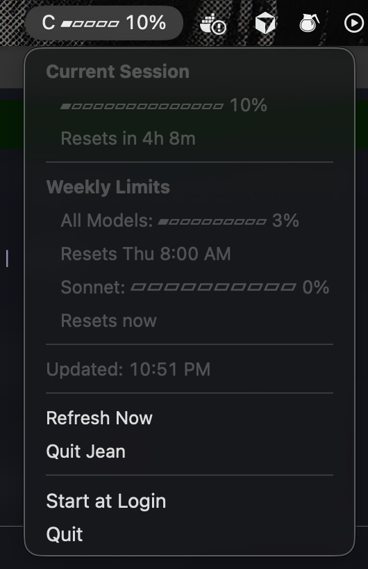
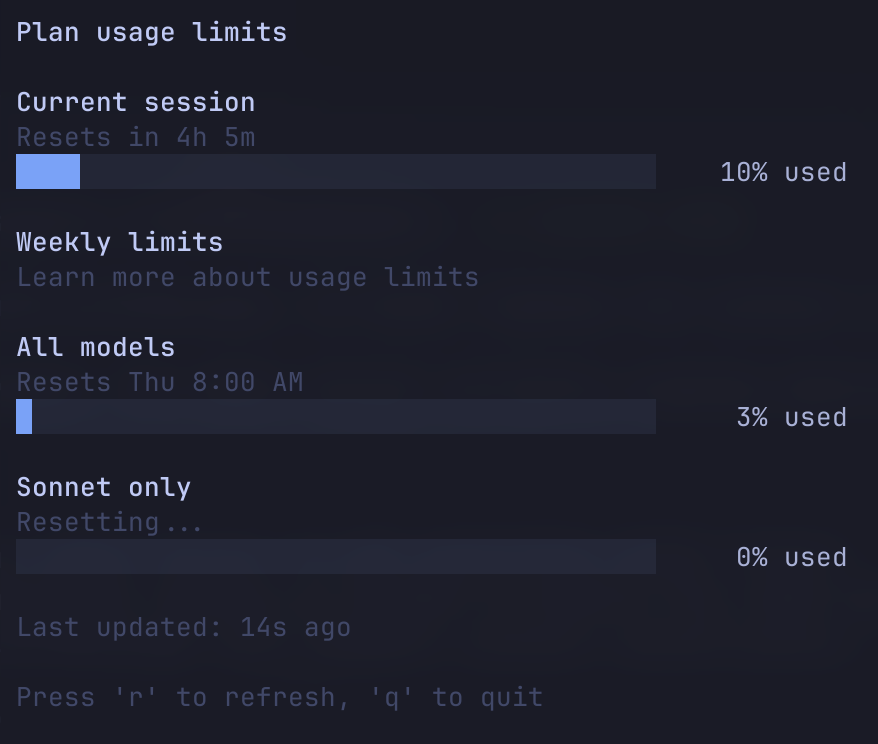

# Jean

A macOS menu bar app that shows your Claude usage limits in real-time.


## Features

- **Live usage monitoring** - See your current Claude session usage directly in the menu bar
- **Progress bar visualization** - Quick visual indicator of usage (▰▰▱▱▱)
- **Automatic refresh** - Updates every 30 seconds
- **No manual token management** - Reads credentials directly from Claude Desktop
- **Detailed breakdown** - Click to see current session + weekly limits

## Screenshots

### Menu Bar


### Terminal UI


## Requirements

- macOS (tested on macOS 14+)
- [Claude Desktop](https://claude.ai/download) installed and logged in
- Go 1.21+ (for building from source)

## Installation

### From Source

```bash
git clone https://github.com/omriza/jean.git
cd jean
make build
./bin/jean-menubar
```

### Using Go Install

```bash
go install github.com/omriza/jean/cmd/menubar@latest
```

### First Run

On first run, macOS will prompt for Keychain access to "Claude Safe Storage". Click **"Always Allow"** to grant permanent access (avoids repeated prompts).

## How It Works

Jean reads your Claude session credentials directly from Claude Desktop's cookie storage:

1. **Cookie Decryption** - Reads encrypted cookies from `~/Library/Application Support/Claude/Cookies`
2. **Keychain Access** - Retrieves the decryption key from macOS Keychain ("Claude Safe Storage")
3. **API Polling** - Calls `claude.ai/api/organizations/{org}/usage` every 30 seconds
4. **Menu Bar Display** - Shows current session usage as a progress bar

### API Response Format

```json
{
  "five_hour": {
    "utilization": 10.0,
    "resets_at": "2026-01-22T15:00:00Z"
  },
  "seven_day": {
    "utilization": 3.0,
    "resets_at": "2026-01-29T08:00:00Z"
  },
  "seven_day_sonnet": {
    "utilization": 0.0,
    "resets_at": "2026-01-22T15:00:00Z"
  }
}
```

| API Field | Description |
|-----------|-------------|
| `five_hour` | Current session (resets every 5 hours) |
| `seven_day` | Weekly limit for all models |
| `seven_day_sonnet` | Weekly limit for Sonnet specifically |

## Project Structure

```
jean/
├── cmd/
│   ├── menubar/main.go          # Menu bar version
│   └── tui/main.go              # Terminal UI version
├── internal/
│   ├── auth/cookie.go           # Claude Desktop cookie decryption
│   ├── api/usage.go             # Claude API client
│   └── tui/model.go             # Terminal UI (bubbletea)
├── assets/                      # Screenshots
├── docs/ROADMAP.md              # Detailed roadmap
├── Makefile                     # Build automation
├── go.mod
└── README.md
```

## Usage

### Menu Bar App (Recommended)

```bash
make run
# or
./bin/jean-menubar
```

Runs in the background. Click the menu bar icon to see details, or "Quit Jean" to exit.

### Terminal UI

```bash
make run-tui
# or
./bin/jean
```

Full-screen terminal interface with live updates. Press `r` to refresh, `q` to quit.

### Development

```bash
make dev    # Rebuild and restart menu bar app
make help   # Show all available commands
```

## Troubleshooting

### "Failed to get keychain password"

- Make sure Claude Desktop is installed and you've logged in at least once
- When prompted for Keychain access, click "Always Allow"
- If you denied access, go to Keychain Access app → Find "Claude Safe Storage" → Reset permissions

### Menu bar icon not visible

- The icon might be hidden behind the notch on newer MacBooks
- Use a menu bar manager app (Bartender, Hidden Bar) to rearrange icons
- Or resize the menu bar title in code

### "Session key pattern not found"

- Your Claude Desktop session may have expired
- Open Claude Desktop and log in again

## Roadmap

### v0.1 (Current - Alpha)
- [x] Basic menu bar app
- [x] Current session + weekly limits display
- [x] Auto-refresh every 30 seconds
- [x] Progress bar visualization

### v0.2 (Beta)
- [ ] CI/CD pipeline (GitHub Actions)
- [ ] Code cleanup and simplification
- [ ] Configuration file support
- [ ] Customizable refresh interval
- [ ] Customizable progress bar style
- [ ] Start at login option

### v0.3 (Release)
- [ ] Homebrew formula
- [ ] Code signing & notarization

### v1.0 (Stable)
- [ ] Open source release
- [ ] Notifications when approaching limits
- [ ] Multiple account support
- [ ] Historical usage tracking
- [ ] Claude Code session monitoring (via OpenTelemetry)

## Technical Notes

### Cookie Encryption

Claude Desktop (Electron/Chromium) encrypts cookies using:
- **Algorithm**: AES-128-CBC
- **Key Derivation**: PBKDF2 with SHA1
- **Salt**: "saltysalt"
- **Iterations**: 1003
- **IV**: 16 spaces
- **Key Storage**: macOS Keychain ("Claude Safe Storage")

The encrypted cookie format is: `v10` prefix (3 bytes) + AES-CBC ciphertext.

### Dependencies

- [bubbletea](https://github.com/charmbracelet/bubbletea) - Terminal UI framework
- [lipgloss](https://github.com/charmbracelet/lipgloss) - Terminal styling
- [menuet](https://github.com/caseymrm/menuet) - macOS menu bar
- [go-sqlite3](https://github.com/mattn/go-sqlite3) - SQLite for cookie database

## Contributing

Contributions welcome! Contributing guidelines coming soon.

## License

MIT

## Acknowledgments

- Claude Desktop for the usage API
- The Charm team for excellent TUI libraries
- Casey Muratori for menuet
